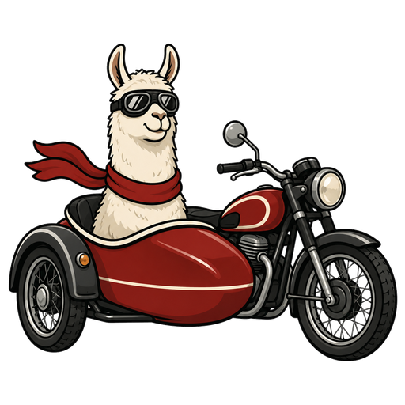

<p align="center">
  
</p>

# lama-sidecar

Poster text/logo removal service for CHUB's CL2K "retexting". Erases text from
poster artwork with full-resolution LaMa inpainting and reconstructs the
background — plus automatic text *detection* (to build erase masks) and 2x/4x
logo super-resolution. CPU-only, runs as non-root.

Speaks the contract CHUB's `lama_sidecar` provider calls:

```
GET  /health                -> {"status":"ok","model_loaded":true}

POST /api/v1/inpaint
     body: {"image":"<base64 image, JPEG/PNG/etc>","mask":"<base64 mask, white=erase>"}
     optional: "dilate":0-64, "feather":0-32, "target_res":0-8192  (per-request
               overrides of the env defaults), "debug":true (JSON response with
               region boxes/scales/timing + the image as base64)
     ->   200, PNG bytes (lossless; only masked pixels differ from the input)
          headers: X-Lama-Regions, X-Lama-Scales, X-Lama-Inference-Ms

POST /api/v1/detect
     body: {"image":"<base64>","min_score":0.5}
     ->   200, {"regions":[{"polygon":[[x,y],...],"score":0.9},...],
                "mask":"<base64 PNG, white=detected text>"}

POST /api/v1/upscale
     body: {"image":"<base64, RGBA kept>","scale":2|4}      (logos; <=2 MP input)
     ->   200, PNG bytes
```

There is **no authentication by default — LAN/Docker-network use only; do not
expose this to the internet.** Set `LAMA_API_KEY` to require an `X-API-Key`
(or `Bearer`) header on all `/api/v1/*` routes; `/health` stays open. CHUB's
`AI API Key` setting sends the same value.

## Models

| | | |
|---|---|---|
| Inpainting | `big-lama.pt` (TorchScript, ~200 MB) | downloaded by `entrypoint.sh` on first start |
| URL | `https://github.com/Sanster/models/releases/download/add_big_lama/big-lama.pt` | |
| MD5 | `e3aa4aaa15225a33ec84f9f4bc47e500` | |
| SHA256 | `344c77bbcb158f17dd143070d1e789f38a66c04202311ae3a258ef66667a9ea9` | |
| License | Apache-2.0 (model weights only — see [License](#license)) | |
| Upscaling | `realesr-general-x4v3.pth` (~4.8 MB) | downloaded lazily on first `/upscale` call from the official xinntao/Real-ESRGAN release; SHA256 pinned in `upscale.py`; loaded with `weights_only=True` |
| Detection | `PP-OCRv6_det_small.onnx` (~10 MB) | downloaded lazily on first `/detect` call — extracted from the SHA256-pinned rapidocr PyPI wheel, model hash verified again after extraction (both pins live in `detect.py`) |

Model downloads land in `/models`, are checksum-verified **before** being moved
into place, and a cached model that fails verification is deleted and
re-downloaded once (no crash loop). Override the inpainting source with
`LAMA_MODEL_URL` / `LAMA_MODEL_MD5` / `LAMA_MODEL_SHA256` (an empty value skips
that checksum).

## Run

```bash
docker run -d --name lama-sidecar --restart unless-stopped \
  -p 8418:8418 \
  -v /path/to/appdata/lama-sidecar:/models \
  ghcr.io/chodeus/lama-sidecar:latest
```

Image ~1.6 GB, ~1–2 GB RAM while inpainting. Listens on **8418**. Runs as
**99:100**. To reach it from CHUB without exposing a host port, put both
containers on the same Docker network and use `http://lama-sidecar:8418`.

### Install on Unraid

1. Copy [`unraid/lama-sidecar.xml`](unraid/lama-sidecar.xml) to
   `/boot/config/plugins/dockerMan/templates-user/` on the server.
2. **Docker** tab → **Add Container** → pick **lama-sidecar** from the template
   dropdown.
3. Check the fields, then **Apply**:

   | Field | Value |
   |---|---|
   | Repository | `ghcr.io/chodeus/lama-sidecar:latest` |
   | Port | `8418` → `8418` (TCP) |
   | `/models` | `/mnt/user/appdata/lama-sidecar` |

4. First start downloads the model (~200 MB); wait until the container shows
   **healthy** before use.

## CHUB config

In CHUB's **Module Settings → CL2K Maker** (or `config.yml` under `cl2k_maker`):

```yaml
  ai_provider: lama_sidecar
  ai_endpoint: 'http://HOST:8418'   # or container name on a shared network
  api_key: ''                       # only if the sidecar sets LAMA_API_KEY
  ai_timeout: 120
  ai_mask_dilate: -1                # -1 = sidecar default (5); the ghosting knob
  ai_logo_upscale: true             # rescue small clear logos via /upscale
```

## Config

| Env | Default | |
|---|---|---|
| `PORT` | `8418` | API port |
| `LAMA_MODEL_PATH` | `/models/big-lama.pt` | model location |
| `LAMA_TARGET_RES` | `1400` | cap on the crop long-edge fed to the model; the actual scale comes from hole geometry (below), but a crop wider than this downscales regardless (a very wide band gains nothing from a native pass); `0` = single whole-frame region |
| `LAMA_REGION_PAD` | `0.5` | context padding around each masked region (fraction of its size) |
| `LAMA_REGION_MIN_PAD` | `64` | minimum context padding (px) so tiny marks still get real context |
| `LAMA_HOLE_RES` | `512` | downscale a region until its hole's long edge fits this… |
| `LAMA_HOLE_THICK` | `384` | …or its thickness fits this — whichever needs *less* downscaling; thin title bands therefore stay at native resolution |
| `LAMA_MASK_DILATE` | `5` | grow the mask by N px to swallow a logo's anti-aliased fringe/glow; `0` = off. Raise to `7–8` for beveled/metallic/glowing logos, lower to `2–3` if your masks are already generous |
| `LAMA_MASK_FEATHER` | `2` | soften the composite seam (px), inward only — pixels outside the dilated mask are always bit-identical to the input; `0` = hard edge |
| `LAMA_SEAM_MATCH` | `1` | per-region gain/bias color match of the fill to its surroundings (kills tonal patches on gradients); `0` = off |
| `LAMA_MAX_CONCURRENCY` | `1` | parallel inference cap; one pass already uses every core |
| `LAMA_API_KEY` | *(empty)* | when set, `/api/v1/*` require it via `X-API-Key`/`Bearer` |
| `LAMA_MAX_PIXELS` | `40000000` | reject images larger than this |
| `LAMA_MAX_B64_CHARS` | `67108864` | reject base64 fields larger than this |
| `LAMA_MAX_BODY_BYTES` | `~150MB` | reject request bodies before they are buffered/parsed |

### Background reconstruction

LaMa fills a hole from its surrounding context, so what limits quality is the
*hole*, not the image: a hole is reconstructable at native resolution when it's
thin enough for context to reach its interior. The sidecar splits the mask into
connected regions and derives each region's scale from its hole geometry:
title wordmarks and small text (thin holes) stay **at native resolution,
razor-sharp**, up to the `LAMA_TARGET_RES` crop cap; genuinely bulky holes are
downscaled until they fit the receptive field, inpainted, upscaled, and
seam-corrected (per-channel gain/bias match against the surrounding ring) so no
tonal patch shows. A band wider than the cap downscales too — over the busy
texture that makes a band that wide, a native pass reconstructs no extra detail,
so it isn't worth the CPU. The composite alpha never exceeds the dilated mask,
so unmasked artwork comes back bit-identical.

A logo's edges are anti-aliased in the artwork, so even a snug mask leaves a
thin fringe (plus any soft glow) outside the hole — which comes back as a faint
ghost outline. `LAMA_MASK_DILATE` grows the mask a few pixels to cover that
fringe, and `LAMA_MASK_FEATHER` softens the composite seam (inward only). This
is the highest-leverage knob for clean logo removal; the default `5`/`2` clears
typical poster wordmarks, and CHUB can override it per-request via its
`ai_mask_dilate` setting — no container restart needed.

## Test

```bash
python test_regions.py                    # torch-free unit tests (geometry)
python test_smoke.py http://HOST:8418     # end-to-end against a running sidecar
```

## Release

Push a `vX.Y.Z` tag via release-please — CI lints, unit-tests, builds, Trivy-scans
(no `ignore-unfixed`; reviewed exceptions live in `.trivyignore` with rationale),
and runs a real-inpaint test. The release workflow rebuilds, **re-scans and
re-smoke-tests the exact image before it is pushed** to GHCR.

## License

Two separate licenses apply:

- **This repository's code** (the sidecar wrapper, Dockerfile, scripts) — MIT,
  see [LICENSE](LICENSE).
- **Model weights** are downloaded at runtime, not bundled in this image or
  repo, and belong to their original authors: `big-lama.pt` (Apache-2.0),
  `realesr-general-x4v3.pth` (Real-ESRGAN, BSD-3-Clause), PP-OCR detection
  models (Apache-2.0).
